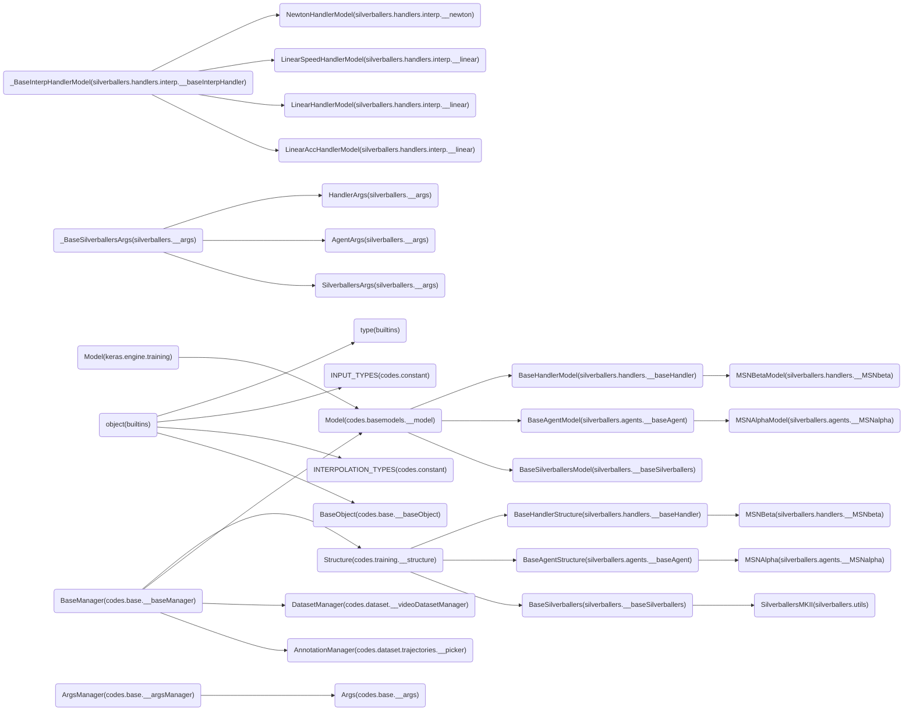

<!--
 * @Author: Conghao Wong
 * @Date: 2022-06-23 09:30:53
 * @LastEditors: Conghao Wong
 * @LastEditTime: 2022-06-23 09:30:53
 * @Description: file content
 * @Github: https://northocean.github.io
 * Copyright 2023 Beihao Xia, All Rights Reserved.
-->

# Classes Used in This Project

Packages:

```mermaid
    graph LR
        codes.base.__baseManager_BaseManager("BaseManager(codes.base.__baseManager)") --> codes.vis.__vis_Visualization("Visualization(codes.vis.__vis)")
        builtins_object("object(builtins)") --> builtins_type("type(builtins)")
        builtins_object("object(builtins)") --> codes.dataset.trajectories.__videoClip_VideoClip("VideoClip(codes.dataset.trajectories.__videoClip)")
        codes.base.__baseObject_BaseObject("BaseObject(codes.base.__baseObject)") --> codes.base.__baseManager_BaseManager("BaseManager(codes.base.__baseManager)")
        codes.base.__baseManager_BaseManager("BaseManager(codes.base.__baseManager)") --> codes.dataset.trajectories.__picker_AnnotationManager("AnnotationManager(codes.dataset.trajectories.__picker)")
        builtins_object("object(builtins)") --> codes.dataset.trajectories.__agent_Agent("Agent(codes.dataset.trajectories.__agent)")
        codes.vis.__helper_BaseVisHelper("BaseVisHelper(codes.vis.__helper)") --> codes.vis.__helper_CoordinateHelper("CoordinateHelper(codes.vis.__helper)")
        codes.vis.__helper_BaseVisHelper("BaseVisHelper(codes.vis.__helper)") --> codes.vis.__helper_BoundingboxHelper("BoundingboxHelper(codes.vis.__helper)")
        builtins_object("object(builtins)") --> codes.vis.__helper_BaseVisHelper("BaseVisHelper(codes.vis.__helper)")
        codes.base.__baseManager_BaseManager("BaseManager(codes.base.__baseManager)") --> codes.training.loss.__lossManager_LossManager("LossManager(codes.training.loss.__lossManager)")
        codes.base.__baseManager_BaseManager("BaseManager(codes.base.__baseManager)") --> codes.training.__structure_Structure("Structure(codes.training.__structure)")
        keras.engine.training_Model("Model(keras.engine.training)") --> codes.basemodels.__model_Model("Model(codes.basemodels.__model)")
        codes.base.__baseManager_BaseManager("BaseManager(codes.base.__baseManager)") --> codes.basemodels.__model_Model("Model(codes.basemodels.__model)")
        builtins_object("object(builtins)") --> codes.constant_INPUT_TYPES("INPUT_TYPES(codes.constant)")
        codes.base.__baseManager_BaseManager("BaseManager(codes.base.__baseManager)") --> codes.dataset.__videoDatasetManager_DatasetManager("DatasetManager(codes.dataset.__videoDatasetManager)")
        codes.base.__argsManager_ArgsManager("ArgsManager(codes.base.__argsManager)") --> codes.base.__args_Args("Args(codes.base.__args)")
        codes.base.__baseManager_BaseManager("BaseManager(codes.base.__baseManager)") --> codes.dataset.__agentManager_AgentManager("AgentManager(codes.dataset.__agentManager)")
        keras.engine.base_layer_Layer("Layer(keras.engine.base_layer)") --> codes.basemodels.interpolation.__newton_NewtonInterpolation("NewtonInterpolation(codes.basemodels.interpolation.__newton)")
        keras.engine.base_layer_Layer("Layer(keras.engine.base_layer)") --> codes.basemodels.interpolation.__linearSpeed_LinearSpeedInterpolation("LinearSpeedInterpolation(codes.basemodels.interpolation.__linearSpeed)")
        keras.engine.base_layer_Layer("Layer(keras.engine.base_layer)") --> codes.basemodels.interpolation.__linearPos_LinearPositionInterpolation("LinearPositionInterpolation(codes.basemodels.interpolation.__linearPos)")
        keras.engine.base_layer_Layer("Layer(keras.engine.base_layer)") --> codes.basemodels.interpolation.__linearAcc_LinearAccInterpolation("LinearAccInterpolation(codes.basemodels.interpolation.__linearAcc)")
        keras.engine.base_layer_Layer("Layer(keras.engine.base_layer)") --> codes.basemodels.layers.__traj_TrajEncoding("TrajEncoding(codes.basemodels.layers.__traj)")
        keras.engine.base_layer_Layer("Layer(keras.engine.base_layer)") --> codes.basemodels.layers.__traj_ContextEncoding("ContextEncoding(codes.basemodels.layers.__traj)")
        codes.basemodels.layers.__pooling__BasePooling2D("_BasePooling2D(codes.basemodels.layers.__pooling)") --> codes.basemodels.layers.__pooling_MaxPooling2D("MaxPooling2D(codes.basemodels.layers.__pooling)")
        keras.layers.pooling.base_pooling2d_Pooling2D("Pooling2D(keras.layers.pooling.base_pooling2d)") --> keras.layers.pooling.max_pooling2d_MaxPooling2D("MaxPooling2D(keras.layers.pooling.max_pooling2d)")
        builtins_object("object(builtins)") --> codes.base.__baseObject_BaseObject("BaseObject(codes.base.__baseObject)")
        codes.basemodels.layers.__linear_LinearLayer("LinearLayer(codes.basemodels.layers.__linear)") --> codes.basemodels.layers.__linear_LinearLayerND("LinearLayerND(codes.basemodels.layers.__linear)")
        keras.engine.base_layer_Layer("Layer(keras.engine.base_layer)") --> codes.basemodels.layers.__linear_LinearLayer("LinearLayer(codes.basemodels.layers.__linear)")
        keras.engine.base_layer_Layer("Layer(keras.engine.base_layer)") --> codes.basemodels.layers.__linear_LinearInterpolation("LinearInterpolation(codes.basemodels.layers.__linear)")
        keras.engine.base_layer_Layer("Layer(keras.engine.base_layer)") --> codes.basemodels.layers.__graphConv_GraphConv("GraphConv(codes.basemodels.layers.__graphConv)")
        codes.basemodels.__model_Model("Model(codes.basemodels.__model)") --> codes.models.__linear_LinearModel("LinearModel(codes.models.__linear)")
        codes.base.__args_Args("Args(codes.base.__args)") --> codes.models.__linear_LinearArgs("LinearArgs(codes.models.__linear)")
        codes.training.__structure_Structure("Structure(codes.training.__structure)") --> codes.models.__linear_Linear("Linear(codes.models.__linear)")
        builtins_object("object(builtins)") --> codes.dataset.trajectories.__videoDataset_Dataset("Dataset(codes.dataset.trajectories.__videoDataset)")
        codes.base.__baseManager_BaseManager("BaseManager(codes.base.__baseManager)") --> codes.dataset.trajectories.__videoClipManager_VideoClipManager("VideoClipManager(codes.dataset.trajectories.__videoClipManager)")
        builtins_object("object(builtins)") --> codes.dataset.trajectories.__trajectory_Trajectory("Trajectory(codes.dataset.trajectories.__trajectory)")
        builtins_object("object(builtins)") --> codes.dataset.trajectories.__picker_Picker("Picker(codes.dataset.trajectories.__picker)")
        codes.dataset.maps.__base_BaseMapManager("BaseMapManager(codes.dataset.maps.__base)") --> codes.dataset.maps.__trajMap_TrajMapManager("TrajMapManager(codes.dataset.maps.__trajMap)")
        codes.base.__baseManager_BaseManager("BaseManager(codes.base.__baseManager)") --> codes.dataset.maps.__base_BaseMapManager("BaseMapManager(codes.dataset.maps.__base)")
        codes.dataset.maps.__base_BaseMapManager("BaseMapManager(codes.dataset.maps.__base)") --> codes.dataset.maps.__socialMap_SocialMapManager("SocialMapManager(codes.dataset.maps.__socialMap)")
        tqdm.utils_Comparable("Comparable(tqdm.utils)") --> tqdm.std_tqdm("tqdm(tqdm.std)")
        builtins_object("object(builtins)") --> codes.constant_PROCESS_TYPES("PROCESS_TYPES(codes.constant)")
        builtins_object("object(builtins)") --> codes.constant_INTERPOLATION_TYPES("INTERPOLATION_TYPES(codes.constant)")
        keras.engine.base_layer_Layer("Layer(keras.engine.base_layer)") --> codes.basemodels.transformer._utils_MultiHeadAttention("MultiHeadAttention(codes.basemodels.transformer._utils)")
        keras.engine.training_Model("Model(keras.engine.training)") --> codes.basemodels.transformer._transformer_TransformerEncoder("TransformerEncoder(codes.basemodels.transformer._transformer)")
        keras.engine.training_Model("Model(keras.engine.training)") --> codes.basemodels.transformer._transformer_Transformer("Transformer(codes.basemodels.transformer._transformer)")
        keras.engine.base_layer_Layer("Layer(keras.engine.base_layer)") --> codes.basemodels.transformer._transformer_EncoderLayer("EncoderLayer(codes.basemodels.transformer._transformer)")
        keras.engine.base_layer_Layer("Layer(keras.engine.base_layer)") --> codes.basemodels.transformer._transformer_Encoder("Encoder(codes.basemodels.transformer._transformer)")
        keras.engine.base_layer_Layer("Layer(keras.engine.base_layer)") --> codes.basemodels.transformer._transformer_DecoderLayer("DecoderLayer(codes.basemodels.transformer._transformer)")
        keras.engine.base_layer_Layer("Layer(keras.engine.base_layer)") --> codes.basemodels.transformer._transformer_Decoder("Decoder(codes.basemodels.transformer._transformer)")
        codes.basemodels.process.__base_BaseProcessLayer("BaseProcessLayer(codes.basemodels.process.__base)") --> codes.basemodels.process.__scale_Scale("Scale(codes.basemodels.process.__scale)")
        keras.engine.base_layer_Layer("Layer(keras.engine.base_layer)") --> codes.basemodels.process.__base_BaseProcessLayer("BaseProcessLayer(codes.basemodels.process.__base)")
        codes.basemodels.process.__base_BaseProcessLayer("BaseProcessLayer(codes.basemodels.process.__base)") --> codes.basemodels.process.__rotate_Rotate("Rotate(codes.basemodels.process.__rotate)")
        codes.basemodels.process.__base_BaseProcessLayer("BaseProcessLayer(codes.basemodels.process.__base)") --> codes.basemodels.process.__move_Move("Move(codes.basemodels.process.__move)")
        keras.engine.training_Model("Model(keras.engine.training)") --> codes.basemodels.process.__base_ProcessModel("ProcessModel(codes.basemodels.process.__base)")
        typing__Final("_Final(typing)") --> typing_TypeVar("TypeVar(typing)")
        typing__Immutable("_Immutable(typing)") --> typing_TypeVar("TypeVar(typing)")
        codes.base.__baseObject_BaseObject("BaseObject(codes.base.__baseObject)") --> codes.base.__argsManager_ArgsManager("ArgsManager(codes.base.__argsManager)")
```

<!-- GRAPH BEGINS HERE -->

<!-- GRAPH ENDS HERE -->