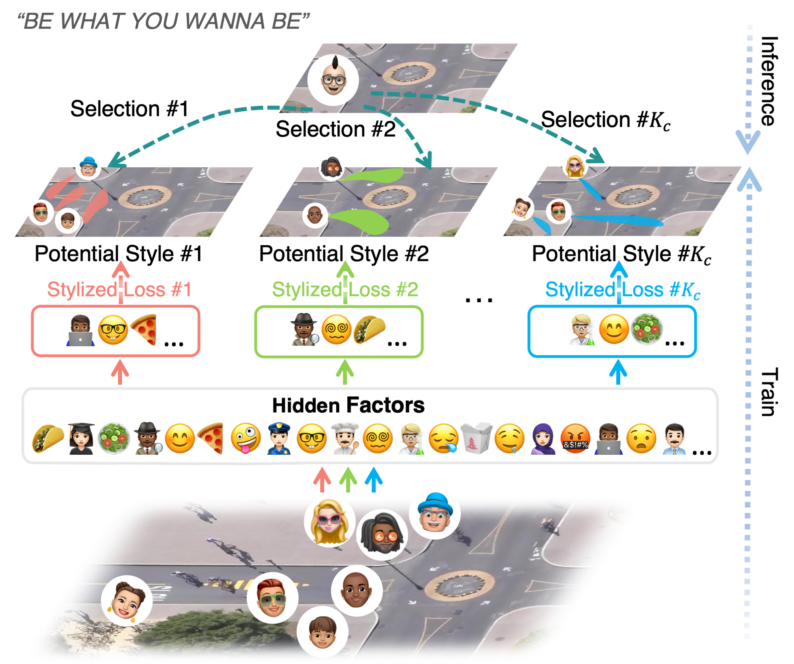

<!--
 * @Author: Conghao Wong
 * @Date: 2023-03-21 17:52:21
 * @LastEditors: Beihao Xia
 * @LastEditTime: 2023-04-25 19:39:25
 * @Description: file content
 * @Github: https://cocoon2wong.github.io
 * Copyright 2023 Conghao Wong, All Rights Reserved.
-->

<link rel="stylesheet" type="text/css" href="./assets/css/user.css">

## Information

This is the homepage of our paper "MSN: Multi-Style Network for Trajectory Prediction
" accepted by IEEE Transactions on Intelligent Transportation Systems.
The paper is publicly available on arXiv.
Click the buttons below for more information.

<div style="text-align: center;">
    <a class="btn btn-colorful btn-lg" href="https://arxiv.org/abs/2107.00932">📖 Paper</a>
    <a class="btn btn-colorful btn-lg" href="./supplementalMaterials">📝 Supplemental Materials</a>
    <br> <br>
    <a class="btn btn-colorful btn-lg" href="https://github.com/NorthOcean/MSN">🛠️ Codes</a>
    <a class="btn btn-colorful btn-lg" href="./use">💡 Codes Guidelines</a>
</div>

## Abstract

<div style="text-align: center;">
    
</div>

Trajectory prediction aims to forecast agents' possible future locations considering their observations along with the video context.
It is strongly needed for many autonomous platforms like tracking, detection, robot navigation, and self-driving cars.
Whether it is agents' internal personality factors, interactive behaviors with the neighborhood, or the influence of surroundings, they all represent impacts on agents' future planning.
However, many previous methods model and predict agents' behaviors with the same strategy or feature distribution, making them challenging to give predictions with sufficient style differences.
This manuscript proposes the Multi-Style Network (MSN), which utilizes style proposal and stylized prediction using two sub-networks, to adaptively give agents multi-style predictions in a novel categorical way.
The proposed network contains a series of style channels, and each channel is bound to a unique and specific behavior style.
In detail, we use agents' end-point plannings and their interaction context as the basis for the behavior classification, so as to adaptively learn multiple diverse behavior styles through these channels.
Then, we assume that the target agents will plan their future behaviors according to each of these categorized styles, thus utilizing different style channels to give potential predictions with significant style differences in parallel.
Experiments show that MSN outperforms current state-of-the-art methods up to 10\% quantitatively on two widely used datasets, and presents better multi-style characteristics qualitatively.

## Citation

If you find this work useful, we would be grateful to cite our paper!

```bib
@article{wong2021msn,
    author = {Wong, Conghao and Xia, Beihao and Peng, Qinmu and Yuan, Wei and You, Xinge},
    journal = {arXiv preprint arXiv:2107.00932},
    title = {MSN: Multi-Style Network for Trajectory Prediction},
    year = {2021},
}
```

## Thanks

All contributors of the repository [MSN](https://github.com/NorthOcean/MSN).

## Contact us

Conghao Wong ([@cocoon2wong](https://github.com/cocoon2wong)): conghao_wong@icloud.com  
Beihao Xia ([@NorthOcean](https://github.com/NorthOcean)): xbh_hust@hust.edu.cn
